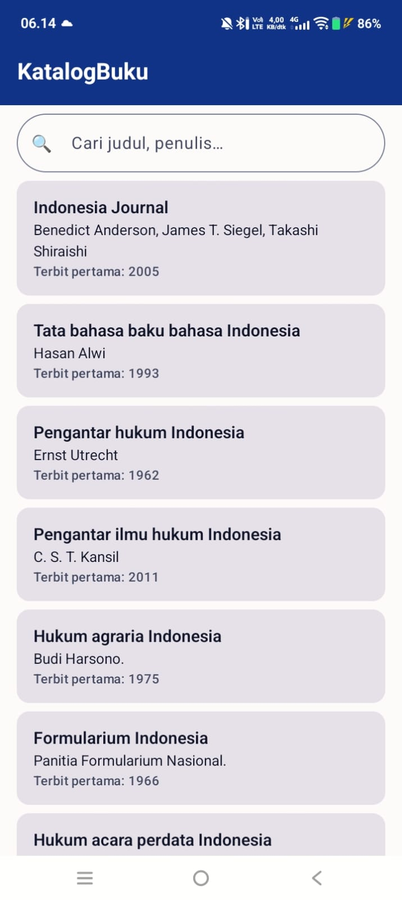
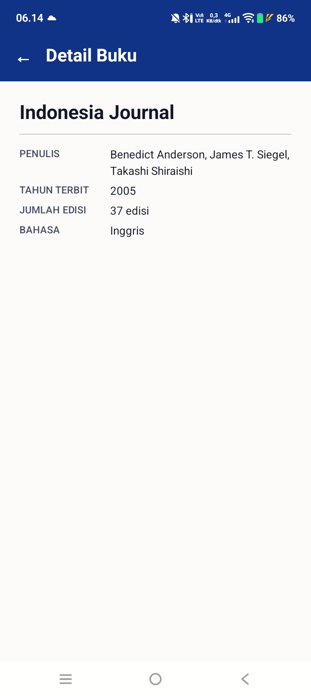

## Pembuat
Nama : Aditya Alfandy
NIM  : H1D024103
Shift Awal : I
Shift Akhir : H


# KatalogBuku

Aplikasi Android untuk mencari dan melihat katalog buku dari OpenLibrary API.
Dibuat dengan Kotlin, Jetpack Compose, dan arsitektur MVVM.


## Screenshot
| Home | Detail |
|---|---|
|  |  |

## Fitur
- Pencarian buku berdasarkan kata kunci
- Daftar buku (judul, penulis, tahun terbit pertama)
- Loading, error (dengan coba lagi), dan empty state
- Halaman detail (penulis, tahun, jumlah edisi, bahasa)
- Tema terang dan gelap (Material 3)

## Arsitektur
MVVM: `Composable → ViewModel → Repository → Retrofit ApiService`

State dikelola dengan `sealed UiState` (Loading / Success / Error) melalui `StateFlow`.

### Struktur package
```text
com.pemmob.katalogbuku
├── MainActivity.kt
├── data
│   ├── model        (BookDto, SearchResponse)
│   ├── remote       (OpenLibraryApi, RetrofitClient)
│   └── repository   (BookRepository)
├── ui
│   ├── theme        (Color.kt, Theme.kt, Type.kt, Spacing.kt)
│   ├── navigation   (AppNavHost.kt, Routes.kt)
│   ├── components   (BookSearchBar.kt, BookItem.kt, LoadingView.kt, ErrorView.kt, EmptyView.kt, InfoRow.kt)
│   ├── home         (HomeScreen.kt, HomeViewModel.kt, HomeUiState.kt)
│   └── detail       (DetailScreen.kt)
└── util             (BookExtensions.kt)
```

## API
- Base URL: `https://openlibrary.org`
- Endpoint: `GET /search.json?q={keyword}&limit=20`
- Field dipakai: `key`, `title`, `author_name`, `first_publish_year`, `edition_count`, `language`
- Tanpa API key. Detail memakai data dari item terpilih (tanpa request kedua).

## Teknologi
Kotlin · Jetpack Compose (Material 3) · Navigation Compose · Lifecycle ViewModel Compose · Retrofit + Gson · minSdk 29 · targetSdk 37

## Cara menjalankan
1. Clone repository
2. Buka di Android Studio (versi terbaru yang mendukung AGP 9.x)
3. Sync Gradle, jalankan di emulator/perangkat (butuh internet)

## APK
Unduh di bagian Releases atau `app-debug.apk`.

## Video penjelasan
(link video)